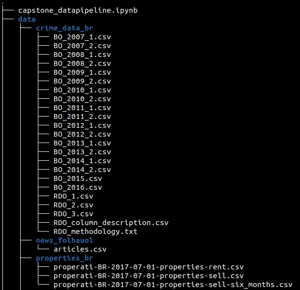

# Data Engineer Nanodegree - Capstone
This project will bring together criminal facts of data and distinct property information in the same locality, São Paulo / Brazil, so that the result of this project is a clean and reliable basis and can be used for statist modeling and business intelligence.

# Requirement
* Kaggle datasets must be downloaded to a given directory. As a suggestion, that project files are mapped for a better structure as in the image below.

## Choice of technology
The data set is large enough that the Pandas library has difficulty organizing, but it doesn't need a large Hadoop cluster either. The choice of Spark comes as a wild card when it comes to scalability as well, and can be executed locally with all the core available in the system.

## Future scenario
If the data volume is increased 100 times, you can configure a Spark cluster sized exactly for this problem, this cluster configuration could be done in AWS EMR, for example.

If we consider that datasets will be updated periodically, daily for example, we can orchestrate Spark calls with AirFlow workflow.

In the scenario where there were 100+ people consuming these data, we could use an AWS Athena as a form of distribution and our Spark job writing directly to AWS S3.